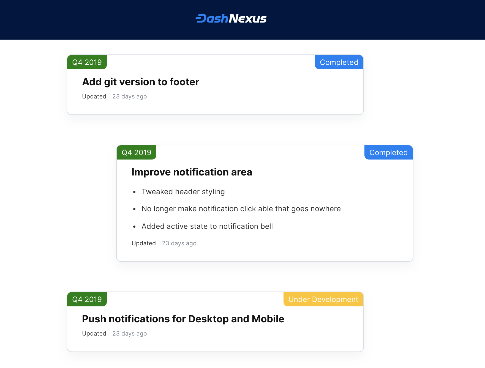

We've needed a nice-looking, user-facing roadmap to share with our users for a long time, and over a couple of days in November I finally built it!

I started once again with Gatsby, my favorite static site builder, and decided to use Trello as a source. This meant that we could manage the roadmap using
a tool that works for us, and show our users a version of it that works for them

