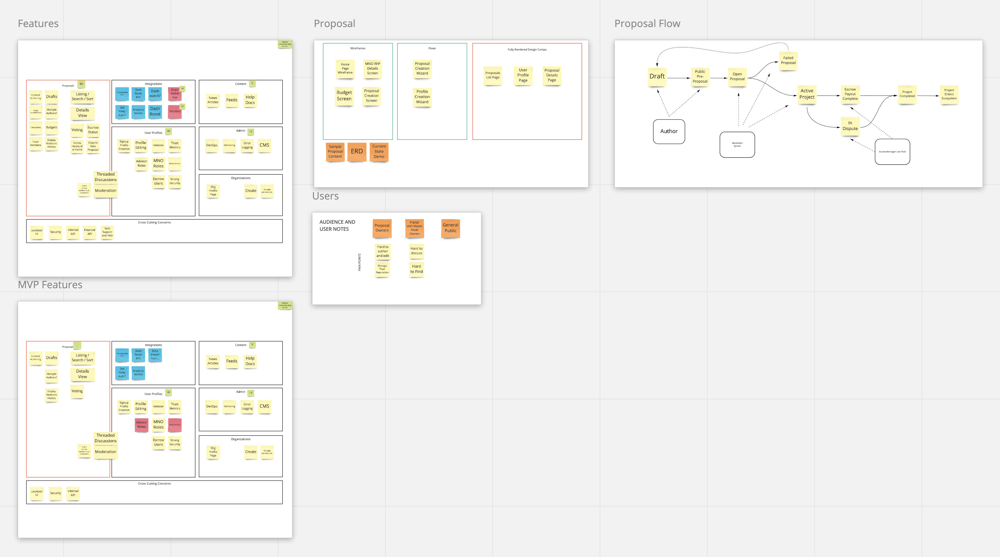

### My Role

My role on the project was both as a project managaer and an occasional code contributor.

While my background in programming is heavily focused on Python, this project gave me an opportunity to learn some Node and React as I followed along with the great developers at [STRV](https://www.strv.com).

Yuri and I began thinking about this project back in 2017 when we saw an opportunity to take the rather complicated and somewhat user-hostile decentralized governance and funding system behind the Dash cryptocurrency.

### The Process

We knew early on that we wanted to build an application that was nice to use on both Desktop and Mobile, while at the same time understanding that there were certain features that just didn't translate well to mobile. So we set to work figuring out what features were critical for a mobile experience, and which ones made the most sense on desktop.

Once we knew which features were most important, we started putting together mock-ups for the UI and UX, working with some talented User Experience designers that we found via Upwork. We worked collaboratively through RealTimeBoard (now Miro) to lay out the different user journies that our users would end up taking, and discovered once again what was most important for the MVP.

### Tech Stack

- Cloudflare
- AWS
- Heroku
- Jira
- Rollbar
- NodeJS
- Python
- React
- Docker
- Postgres
- Redis
- GatsbyJS
