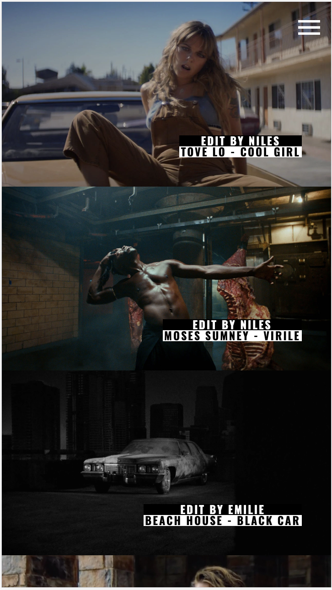

When Kid Sister first reached out in July, I was in Mexico City and had just finished building this website actually. So I was feeling pretty good about my Gatsby skills.

They wanted to do something really unique for their homepage, and I wanted to help make that happen. The brief was for a component that looked and felt like the View Master toy that we played with as kids. We had two options, either to create a template in After Effects that needed to be updated every time the content changed for the homepage, or figure out a way to do it programatically. I opted for the programatic solution, as it meant less effort to maintain and most importantly - that my client could update the site once using Prismic, and every part of it would be updated automatically and pushed back out to the CDN.

So I started looking for the most accomplished WebGL developers I could find and ended up finding one we liked. Vadym did a great job building it in Javascript using PixiJS, but the next challenge was combining it with the rest of the site that is built in declarative React.

> Viewmaster Component

> Gallery

> Mobile
